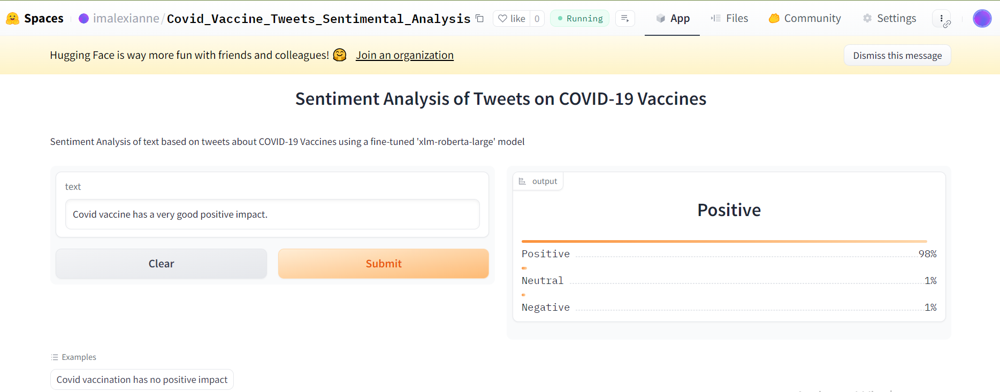

## Description

What's Deep Learning? Just machine learning based on artificial neural networks in which multiple layers of processing are used to extract progressively higher level features from data.
In this project, we will fine-tune pre-trained Deep Learning models from HuggingFace on a new dataset to adapt the models to the task that we want to solve, i.e the prediction of the sentiment expressed in a Tweet (e.g: neutral, positive, negative), then create an app to use the models and deploy the app on the HuggingFace platform.

# Data understanding
Data Understanding
The presented data included two sets: training and testing. My analysis focused on the training set. This dataset encompassed the following attributes:
Tweet id: Contained information about the various unique IDs of each tweet.
safe text: Contained the various tweets from various users.
label: Contained the sentiment score for each tweet. -1 meant the tweet was negative, 0 meant the tweet was neutral, and 1 meant the tweet was positive.
agreement: The tweets were labeled by three people. Agreement indicates the percentage of the three reviewers that agreed on the given label. It shows the confidence level for each sentiment.

# Objectives

Building customizable Graphic User Interface with Gradio.
Fine-tuning pre-trained models.
Hosting models on HuggingFace platform.
Embedding fine-tuned HuggingFace models into Gradio App.
Deploying App on HuggingFace platform.
Create Docker container for App

## Fine-tuning pre-trained models
I fine-tuned two pre-trained models: You can access and explore these fine tuned deployed models below:

[distilbert-base-uncased_latest_Nov2023](https://huggingface.co/imalexianne/distilbert-base-uncased_latest_Nov2023)

[xlm-roberta-large_latest_Nov2023](https://huggingface.co/imalexianne/xlm-roberta-large_latest_Nov2023)

This outline encompasses the key stages of a data science project, from understanding the business context and exploring the data to preparing and modeling, followed by evaluation and deployment of the developed solution. It serves as a roadmap for a systematic and comprehensive approach to data-driven problem-solving.


From the results of the finetuned evaluation set, I decided to move forward embeding distilbert-base-uncased_latest_Nov2023 which has Higher accuracy and low evalustion loss, into a gradio app.


link to a deployed [hugging face gradio app](https://huggingface.co/spaces/imalexianne/Covid_Vaccine_Tweets_Sentimental_Analysis)
# Article 

[LinkedIn Published Article](https://www.linkedin.com/feed/update/urn:li:activity:7129480399478566912/)

# Usage

### 1. Clone this repository to your local machine.
Start by cloning the GitHub repository containing the App by running the following command in your terminal:
```
git clone https://github.com/imalexianne/Covid_Vaccine_Sentimental_Analysis_app
```

2. Navigate to the project directory.

 ### 2. Setup Virtual Environment
You need Python3 on your system to setup this app. Then you can clone this repo and being at the repo's root ::... follow the steps below:
* Windows
```python
    python -m venv venv; venv\Scripts\activate; python -m pip install -q --upgrade pip; python -m pip install -qr requirements.txt 
``` 
* Linux & MacOs
```python
    python3 -m venv venv; source venv/bin/activate; python -m pip install -q --upgrade pip; python -m pip install -qr requirements.txt  

```
### 3. Install Dependencies:
Install the required Python packages within your virtual environment:
```
pip install -r requirements.txt
```

 # To run the Application Script
 ``````
 python app.py
``````
# Pretrained Model and Analysis
To better understand all behind the app, you can explore the directory [here](https://github.com/imalexianne/Covid_Vaccine_Sentimental_Analysis_app/). It contains detailed information about the data preprocessing, model training, and evaluation that contributed to the creation of the app's predictive capabilities.

# Feedback and Support

Email: imalexianne@gmail.com

# Author
Alexianne Imanirakarama
